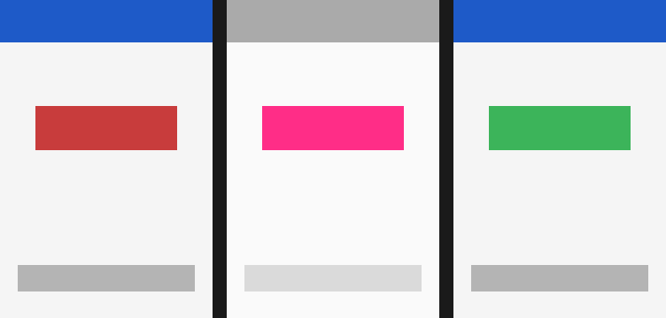

# shotdiff

Side-by-side screenshot diff for the **screenshot → edit code → rebuild → screenshot** loop.
Pass two images and `shotdiff` lays them out as `BEFORE | DIFF | AFTER`, painting every
changed pixel **pink** so the difference jumps out.



Two output modes:

- **PNG mode (default)** — writes a composite PNG. No browser, no GUI, pure pixel work.
  Runs anywhere, including CI. Exit codes make it a drop-in visual-regression gate.
- **Browser mode (`--browser`)** — writes a self-contained HTML viewer and opens it.
  Interactive threshold slider, zoom, and a grey/colour context toggle.

## Install

Via Homebrew tap:

```sh
brew install matuyuhi/tools/shotdiff
```

Or build from source (needs a Rust toolchain):

```sh
cargo install --path .
```

## Usage

```sh
shotdiff <BEFORE> <AFTER> [OPTIONS]
```

```sh
# Composite PNG (default → ./shotdiff-out.png)
shotdiff before.png after.png

# Choose the output path
shotdiff before.png after.png -o diff.png

# Interactive viewer in the browser
shotdiff before.png after.png --browser

# Only the centre DIFF panel
shotdiff before.png after.png --diff-only -o diff.png
```

### Options

| Option | Description |
| --- | --- |
| `-o, --output <PATH>` | Output PNG path (default `shotdiff-out.png`) |
| `-t, --threshold <N>` | Per-channel diff threshold `0-255` (default `16`) |
| `--diff-only` | Output only the centre DIFF panel |
| `--browser` | Build an interactive HTML viewer and open it |
| `--fail-on-diff` | Exit `1` if any pixel changed |
| `--max-diff <V>` | Fail only if change exceeds `V` — e.g. `1200` (pixels) or `0.5%` |
| `-h, --help` | Show help |

### Exit codes

| Code | Meaning |
| --- | --- |
| `0` | Success — no diff, or a diff that did not trip the gate |
| `1` | Diff exceeded the configured gate (`--fail-on-diff` / `--max-diff`) |
| `2` | Usage or I/O error |

Stats (dimensions, changed-pixel count, percentage) are printed to **stderr**, so they
show up in CI logs without polluting stdout.

## CI: visual-regression gate

```yaml
# .github/workflows/visual.yml (excerpt)
- name: Install shotdiff
  run: brew install matuyuhi/tools/shotdiff

- name: Compare screenshots
  run: |
    shotdiff baseline/home.png current/home.png \
      -o artifacts/home-diff.png \
      --max-diff 0.2%
```

The step fails when more than 0.2 % of pixels changed, and `artifacts/home-diff.png`
is left behind for inspection.

## How it works

1. Both images are decoded to RGBA (PNG / JPEG / WebP / GIF / BMP via the `image` crate).
2. If sizes differ, each is placed top-left on a canvas sized to the larger of the two,
   the padding is transparent, and a `size mismatch` warning is printed. (For very
   different sizes a naive pixel diff is mostly noise — align your captures first.)
3. Per pixel, the max absolute channel difference across RGBA is compared to the
   threshold. Above it → pink. Below → a dimmed greyscale of the AFTER pixel, as quiet
   context so the pink stands out.
4. PNG mode composites `BEFORE | DIFF | AFTER`; browser mode runs the same comparison in
   canvas/JS so the threshold can be tuned live.

> iOS/Android screenshots are PNG, so they work out of the box. HEIC is not decoded.

## Notes

- iOS and Android screenshots from the same device have identical dimensions, which is
  the happy path. Mismatched sizes are aligned top-left, not scaled.
- Browser mode embeds the images as base64 data URIs, so the generated HTML is a single
  self-contained file you can move or share.

## Development

```sh
cargo build --release
cargo run --release --example gen_fixtures   # regenerate examples/*.png
```
